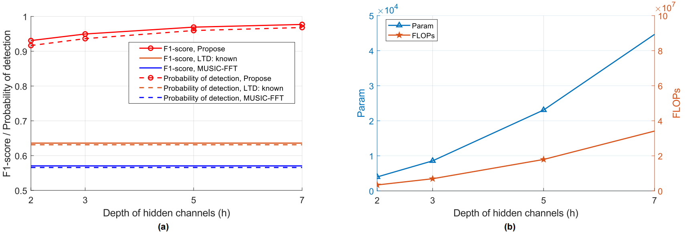

## Overview

This is the PyTorch implementation of paper [CSIYOLO: An Intelligent CSI-based Scatter Sensing Framework for Integrated Sensing and Communication Systems](https://arxiv.org), which has been submitted to IEEE for possible publication.

## Requirements

To use this project, please ensure the following dependencies are installed:

- [Python >= 3.8](https://www.python.org/)
- [PyTorch >= 1.13.0](https://pytorch.org/get-started/previous-versions/#v1130)
- numpy
- scipy
- tqdm
- thop
- matplotlib

## Data Preparation


The channel state information (CSI) matrix is generated according to the Saleh-Valenzuela channel model using MATLAB. The detailed parameters are listed in Table I of the paper. We also provide a pre-processed version for direct download in [Google Drive](https://drive.google.com/drive/folders/1fU6WrnS5_C6KRfWzy741IKJOUGSOkP7X?usp=sharing), which is easier to use for this task. You can also download it from [Baidu Netdisk](https://pan.baidu.com/s/1mvzeEoCET3X9xYdL0arjTQ?pwd=x966).
You can also generate your own dataset based on the Saleh-Valenzuela channel model. The details of data generation and pre-processing can be found in our paper.


## Checkpoints Downloading

The model checkpoints should be downloaded if you would like to reproduce our results. The checkpoints can be downloaded from [Google Drive](https://drive.google.com/drive/folders/1dxp3aqC82f5UI2jMmo10OHiQuRKpaR_8?usp=sharing) or [Baidu Netdisk](https://pan.baidu.com/s/160rnINduc_lvMHNhxkXFIA?pwd=u86y).

## Project Structure

We recommend organizing your project directory as follows:

```
home
├── csiyolo
│   ├── configs
│   │   ├── ...                # Config files
│   ├── dataset
│   │   ├── ...                # Dataset modules
│   ├── models
│   │   ├── ...                # Model definitions
│   ├── utils
│   │   ├── ...                # Utility functions
│   ├── tools
│   │   ├── train.py              # Main function of training
│   │   ├── val.py                # Main function of testing
│   ├── scripts
│   │   ├── run_train.sh           # Training script
│   │   ├── run_eval.sh            # Testing/Evaluation script
├── checkpoints
│   ├── ...                # Pre-trained checkpoints
├── data
│   ├── ...                # Pre-downloaded data files
...
```

## Training and Testing

### Training from scratch

An example of `run_train.sh` is provided under the scripts. Simply use it with `bash ./scripts/run_train.sh`. It will start the CSIYOLO training from scratch, with validation and testing.

Example usage:
```bash
python /home/csiyolo/tools/train.py \
    --imgsz 64 \    # input image size.
    --batch-size 64 \   # batchsize for training.
    --Ns-max 10 \   # maximum number of scatters for process.
    --cfg "/home/csiyolo/configs/config.yaml" \  # configuration file for the model, which controls the detailed model architecture such as h.
    --data-path "/home/data/" \   # path to the data files.
    --epochs 100 \  # number of training epochs.
    --device 0 \    # GPU device for training. 
    --project "/home/runs/train" \    # directory for the training logs and results.
    --noise-bound 0 \  # maximum injected noise variance for training. Set to 0 for no noise injection.
    --detect-thres 1 \  # distance threshold for detection. Default 1m in this experiment.
    --val-freq 10 \ # validation frequency.
    --test-freq 20    # test frequency.
```


### Testing/Evaluation

An example of `run_eval.sh` is provided under the scripts. Simply use it with `bash ./scripts/run_eval.sh`. It will start the CSIYOLO testing. 

Example usage:
```bash
python ./tools/val.py \
    --Ns-max 10 \   # maximum number of scatters for process.
    --imgsz 64 \    # input image size.
    --batch-size 64 \   # batchsize for testing.
    --data-path "/home/data/" \ # path to the data files.
    --device 0 \    # GPU device for testing.
    --project '/home/runs/eval' \     # directory for the testing logs and results.
    --pretrained '/home/checkpoints/h5/ckpt.pt' \   # path to the evaluated model.
    --cfg "/home/checkpoints/h5/config.yaml" \ # configuration file for the model, which controls the detailed model architecture such as h.
    --detect-thres 1    # distance threshold for detection. Default 1m in this experiment.
```

## Results and Reproduction

The main results reported in our paper are presented as follows. All the listed results can be found in Fig. 14 of the paper. They are achieved from training CSIYOLO with different hidden channel depths. Both the training and testing datasets are consisted of samples with varying numbers of scatters from 5 to 10.

The main results achieved by this repository are summarized below.  

### Performance Table

Depth of <br> hidden channels | F1-score | Probability <br> of detection | RMSE(m) | Params | FLOPs | Checkpoints
:--: | :--: | :--: | :--: | :--: | :--: | :--:
2 | 0.9307 | 0.9164 | 0.3056 | 3.977K | 3.390M | h2/ckpt.pt |
3 | 0.9496 | 0.9362 | 0.2317  | 8.571K | 6.934M | h3/ckpt.pt |
5 | 0.9693 | 0.9595 | 0.1949 | 23.069K | 17.930M | h5/ckpt.pt |
7 | 0.9770 | 0.9682 | 0.1579 | 44.647K | 34.136M | h7/ckpt.pt |


The corresponding comparison figure is shown below.



## Acknowledgment

This repository is inspired by and modified from [YOLOv5](https://github.com/ultralytics/yolov5). Special thanks to the authors for their contributions to the community.
